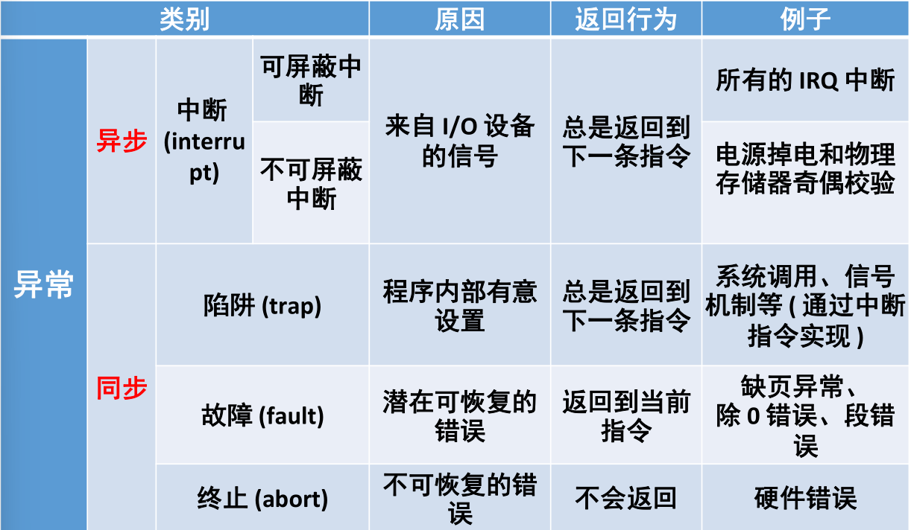

# 一、操作系统概论

### 批处理

把用户提交的作业成批送入计算机，由作业调度程序自动选择作业运行。

作用：

1. 缩短作业之间的交接时间

2. 减少处理机的空闲等待，提高系统效率

### 多道程序

指允许多个程序同时进入内存并运行。即同时把多个程序放入内存中，并允许它们交替在CPU中运行

好处：

1. 提高CPU利用率；
2. 提高I/O设备和内存利用率；
3. 进而提高系统效率

### 分时

多个用户分享使用同一台计算机。多个程序分时共享硬件和软件资源。

### 分布式操作系统

网络操作系统：在传统单机OS上加单独软件层，主要提供联网功能和资源的远程访问，实现多机互联。

分布式操作系统：多台机器统一管理形成单一系统，相比网络操作系统，对用户和应用高度透明(看不到也不需要看到)

实时系统：及时响应，高可靠性和安全性，系统的整体性强，交互会话活动较弱，专用系统

### 操作系统主要功能

进程管理，存储器管理，设备管理，文件系统，作业控制

### 现代操作系统的基本特征

并发执行，资源共享(复用)，虚拟化管理，不确定性事件的处理

### 操作系统工作模式

内核态(管态)，用户态(目态)；

切换过程：通过异常(陷阱或中断)，进入内核态

### 异常与中断

中断：主要由I/O设备、处理器时钟或定时器等硬件产生，可以被启用或禁用

陷阱：用户进程中某一特定指令执行的结果，

在相同条件下，异常可以重现，例如内存访问错误、调试指令以及被零除。

### 系统调用

提供操作系统服务的编程接口

与函数调用的区别：

1. 用户态到内核态，切换堆栈
2. 移植性差
3. 开销较大

过程：先跳转到异常分发代码，通过异常类型调用handle_sys函数根据系统调用号完成系统调用的实现。

### 操作系统内核

是一个操作系统的核心。它负责管理系统的进程、内存、设备驱动程序、文件和网络系统，决定着系统的性能和稳定性。通过异常来陷入内核态。

### 微内核

内核只完成不得不完成的功能，其他诸如文件系统、内存管理、设备驱动等的内容都被作为系统进程放到了用户态空间。

好处：架构独立，减小系统耦合，增加可移植性。

坏处：频繁系统调用，效率难以保证。

## 测试题

##### 分时系统与批处理系统相比，主要的开销是什么？

管理时间片的系统开销、管理多用户的系统开销、管理硬件的系统开销（引入了虚存）、交互IO的系统开销等等。

